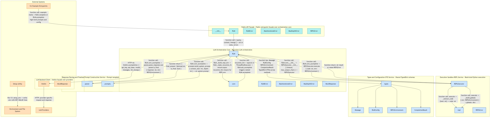
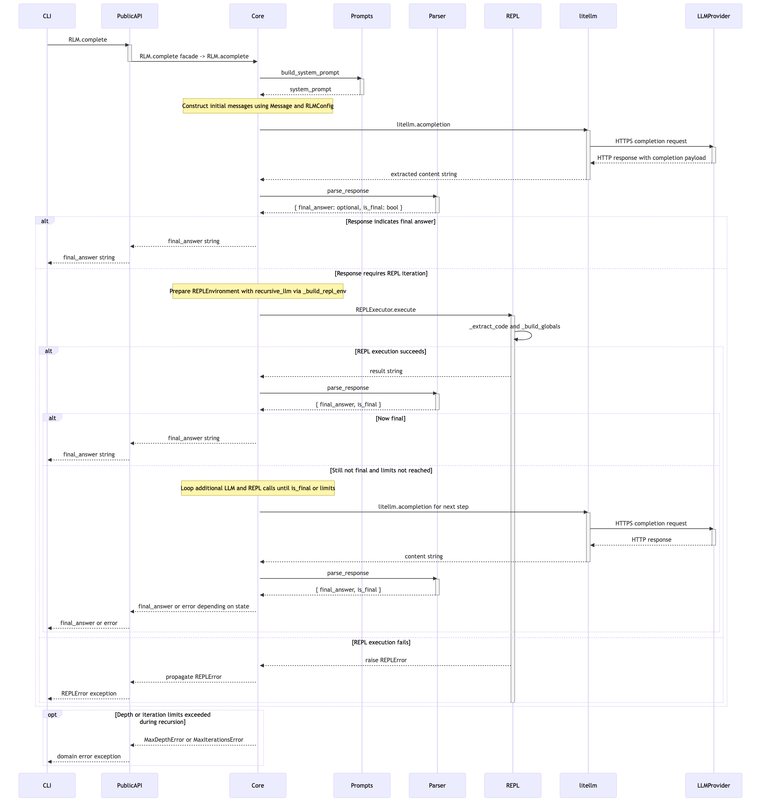
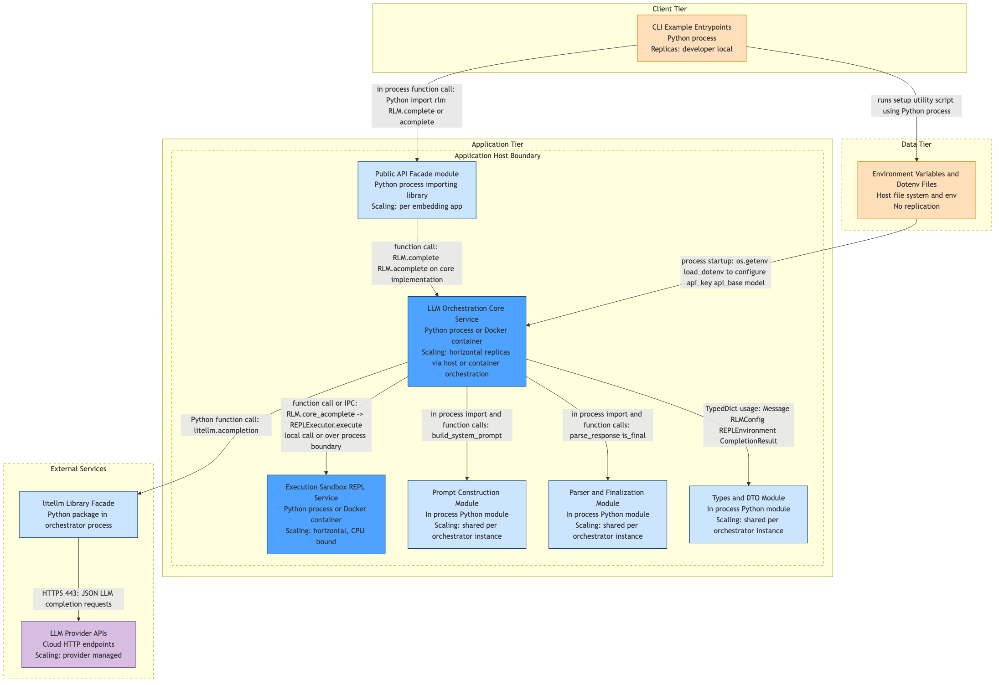
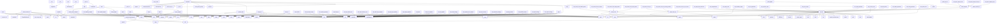
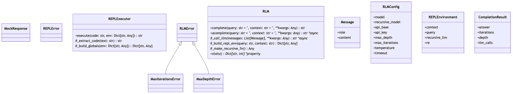
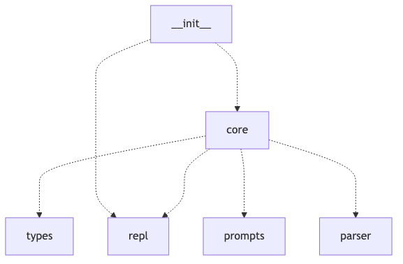

# CodeMap

> AI-Powered Code Architecture Analysis & Documentation Generator

CodeMap ingests any GitHub repository and automatically produces architecture diagrams, function summaries, and actionable insights — powered by LLMs. Whether you're navigating a legacy codebase, onboarding new developers, or just trying to understand what you inherited, CodeMap does the heavy lifting.

---

## Features

- **Automatic code analysis** — extracts classes, functions, and module dependencies
- **AI-generated function summaries** — plain-English explanations of what every function does
- **Architecture diagrams** — application structure, data flow, and deployment views
- **Pattern detection** — identifies design patterns, anti-patterns, and architectural styles
- **Icon-enriched Mermaid diagrams** — clean, visual, auto-rendered to PNG
- **Self-healing diagrams** — broken Mermaid syntax is auto-fixed by the LLM

---

## How It Works

The pipeline runs in **7 sequential steps**:

### Step 1 — Ingest
Clones the target GitHub repository and reads all source files into memory, preparing them for analysis.

### Step 2 — Analyze
Parses the ingested code to extract:
- All **classes** and **functions**
- **Dependencies** between modules

A summary of discovered functions is saved to `codemap/function_summary.json`.

### Step 3 — Structural Diagrams
Generates diagrams purely from the code's structure — no AI involved at this stage. Diagrams are saved as `.mmd` (Mermaid) files, then cleaned up and enriched with icons automatically.

Output: `diagrams/`

### Step 4 — Function Summaries 
Sends domain functions to an LLM in batches of 10 to generate plain-English descriptions of what each function does.

Output: `codemap/function_llm_summaries.json`

### Step 5 — Pattern Detection 
Analyzes the codebase for:
- **Design patterns** (e.g. factory, singleton)
- **Anti-patterns** (e.g. god classes, circular deps)
- **Architectural patterns** (e.g. layered, event-driven)

Output: `codemap/pattern_detection.json`

### Step 6 — Architecture Analysis 
Combines all prior outputs — code structure, function summaries, detected patterns, and structural diagrams — to produce a high-level architectural overview and recommendations.

Output: `codemap/architecture/`

### Step 7 — Render Diagrams
Converts all `.mmd` files (both structural and architectural) into **PNG images**. If a diagram has syntax errors, the renderer attempts to auto-heal it using an LLM before retrying.

---

## Example: `recursive-llm`

> Analyzed repo: [`ysz/recursive-llm`](https://github.com/ysz/recursive-llm)

### Pipeline Output

```
────────────────────────────────────────────────────────────
  Pipeline Complete
────────────────────────────────────────────────────────────
 
  System                  : Recursive LLM Orchestrator
  Total time              : 262.0s
  Total LLM calls         : ~11
 
  Function list           : codemap/function_summary.json
  LLM summaries           : codemap/function_llm_summaries.json
  Pattern report          : codemap/pattern_detection.json
 
  Structural diagrams     : diagrams/
    ✓ call_graph_2.mmd
    ✓ class_0.mmd
    ✓ dependency_1.mmd
 
  Architecture            : codemap/architecture/
    ✓ application_architecture.mmd
    ✓ data_flow.mmd
    ✓ deployment_architecture.mmd
      architecture_plan.json
 
  Top recommendations:
    •  Run the REPL execution sandbox (REPLExecutor) in a separate, heavily
       restricted process or container rather than in-process exec/eval. Use
       IPC (e.g., stdin/stdout over a subprocess or gRPC/HTTP to a sandbox
       service) with strict timeouts and resource limits to contain arbitrary
       code execution.
    •  Harden the REPL global environment: whitelist only safe, deterministic
       functions and immutable data, avoid exposing file system, network,
       threading, or OS modules, and carefully vet any helpers injected via
       _build_repl_env (including recursive_llm).
    •  Enforce and test timeouts for REPLExecutor.execute and recursive LLM
       calls. Add explicit enforcement via signal, multiprocessing with
       timeouts, or subprocess kill after a configured duration.
 
  Security concerns:
    ⚠  REPLExecutor.execute uses exec and eval on LLM-generated code — any
       sandbox escape or insufficiently filtered builtins/globals could allow
       arbitrary code execution, especially if queries are user-controlled.
    ⚠  compile_restricted_exec usage suggests a custom restriction mechanism;
       without a separate process or OS-level sandbox, this should be treated
       as untrusted code execution in the orchestrator process.
    ⚠  RLM._make_recursive_fn exposes recursive_llm into the REPL env —
       without rate limiting or depth enforcement, an attacker could induce
       excessive LLM calls or resource exhaustion.
```

---

### Architecture Diagrams

#### Application Architecture


#### Data Flow


#### Deployment Architecture


---

### Structural Diagrams

#### Call Graph


#### Class Diagram


#### Dependency Graph


---

### Detected Patterns

```json
{
  "design_patterns": [
    {
      "pattern_name": "Facade",
      "pattern_type": "design_pattern",
      "confidence": "medium",
      "location": "__init__.py (exporting RLM and error types)",
      "evidence": "__init__ re-exports RLM and several error classes from submodules, suggesting a simplified external interface over internal modules core, repl, types, prompts, parser.",
      "suggestion": "Maintain the __init__ exports as the primary public API and keep internal modules cohesive and possibly private to preserve the facade boundary."
    }
  ],
  "anti_patterns": [
    {
      "pattern_name": "Potential God Class in RLM",
      "pattern_type": "anti_pattern",
      "confidence": "low",
      "location": "core.RLM",
      "evidence": "RLM owns configuration (via RLMConfig), LLM calling (_call_llm), REPL environment construction (_build_repl_env), recursion control (_make_recursive_fn, MaxDepthError, MaxIterationsError), and exposes completion APIs (complete, acomplete, stats). This concentration of responsibilities may indicate a central, multi-purpose class.",
      "suggestion": "Review RLM responsibilities and consider extracting separate services (e.g., an LLMClient, a RecursionController, a REPLEnvironmentBuilder) if the implementation has grown large or complex."
    }
  ],
  "architectural_patterns": [
    {
      "pattern_name": "Layered / Modular Core with Public API Layer",
      "pattern_type": "architectural",
      "confidence": "medium",
      "location": "Package root (__init__), core, repl, types, prompts, parser",
      "evidence": "__init__ serves as a public API over underlying modules. core depends on types, repl, prompts, and parser but not vice versa, suggesting a central orchestration layer (core) over more focused utility or service-like modules.",
      "suggestion": "Preserve this layering by preventing lower-level modules (e.g., parser, prompts, types, repl) from importing core, and document __init__ as the main entrypoint for consumers."
    }
  ],
  "summary": "The codebase implements an LLM orchestration layer (RLM) that exposes simple completion APIs while internally managing prompt construction, recursive calls, a restricted Python REPL for tool-like execution, and a lightweight protocol using FINAL/FINAL_VAR markers to signal final answers. RLM acts as a facade over litellm\u2019s completion API and a REPL executor, with helper functions for building prompts and parsing LLM responses, and several example scripts demonstrating usage with different backends (remote models, Ollama, local llama.cpp, multi-model scenarios). Architecturally, this forms a small layered system with a central service (RLM), infrastructure components (litellm client, REPL sandbox), and a bespoke DSL where the LLM emits code and finalization directives that the host parses and executes to produce structured results."
}
```

### Sample Function Summaries

```json
{
  "setup_env": {
    "purpose": "Interactively guide the user through creating or updating a .env configuration file.",
    "inputs": "User input via stdin (prompts for keys/values); possibly an existing .env file on disk.",
    "outputs": "Returns None or a status indicator; primary result is a written/updated .env file.",
    "notes": "Side effects include reading/writing files and interacting with the terminal; may overwrite or append to an existing .env, and can raise I/O errors on failure."
  }
}
```

---

## Roadmap

### v0.1.0 — Done
- [x] Basic code analysis

### v0.2.0 — Complete
- [x] LLM function summarization with batching and retry
- [x] Design pattern and anti-pattern detection
- [x] Production architecture diagrams (application, deployment, data flow)
- [x] Icon injection into Mermaid diagrams
- [x] Mermaid post-processing (syntax cleanup)
- [x] Full 7-step pipeline with timing and LLM call tracking

### v0.3.0 — Planned
- [ ] Multi-language support (JavaScript, TypeScript, Java, Go)
- [ ] Interactive web UI to explore diagrams and summaries
- [ ] GitHub Actions integration — run on every PR
- [ ] Incremental analysis — only re-analyze changed files
- [ ] Cost estimator — preview LLM call count before running